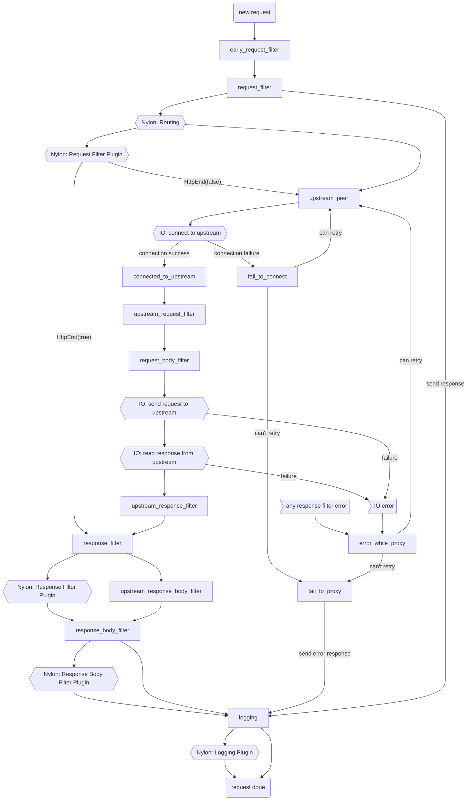

import Footer from './../../components/footer.mdx';

# Why Choose Nylon?

**Nylon** is a next-generation proxy server and API gateway built for speed, extensibility, and real-world developer needs.

- **Lightning-fast.** Built on [Cloudflare Pingora](https://github.com/cloudflare/pingora), proven in global-scale production.
- **True extensibility.** Write plugins in Go, Rust, Zig, C — via FlatBuffers + ultra-fast FFI.
- **One YAML to rule them all.** Configure routes, plugins, TLS, and load balancing in a single, GitOps-friendly config.
- **Built for the cloud-native era.** Scale to millions of requests with full observability and reliability.

> 🚀 **See real-world plugins:**  
> [Nylon Go Plugin Examples →](https://github.com/AssetsArt/nylon/tree/main/examples/go)

---

# Extensible by Design

Add or customize functionality **without forking or patching Nylon core** — just write a plugin!

```go
// Go Example: Minimal Middleware Plugin

//export sdk_go_mid_request_filter
func sdk_go_mid_request_filter(ptr *C.uchar, input_len C.int) C.FfiOutput {
    dispatcher := InputToDispatcher(ptr, input_len)
    ctx := dispatcher.SwitchDataToHttpContext()
    ctx.Request.SetHeader("x-nylon-middleware", "true")
    dispatcher.SetHttpEnd(false)
    dispatcher.SetData(ctx.ToBytes())
    return SendResponse(dispatcher)
}
```

* **Language-agnostic plugins:** Go, Rust, Zig, C, and more
* **Zero vendor lock-in**
* **Fastest possible bridge:** All plugin calls use FlatBuffers over native FFI

👉 **Want to build your own?**
Read the [Plugin System](/plugin-system)

---
### How Nylon Works

Nylon is built on top of [Cloudflare Pingora](https://github.com/cloudflare/pingora), a battle-tested proxy engine designed for performance, reliability, and security at global scale. Nylon leverages Pingora’s ultra-efficient core to handle connection pooling, IO, and low-level protocol work—**but adds a powerful plugin system and flexible routing engine to make advanced customization possible for everyone.**

**Core Request Flow:**
- Every client request first enters the Pingora core, which provides efficient networking and connection management.
- Nylon’s request lifecycle then takes over, processing each request through a chain of routing, plugin filters, and dynamic service logic—**all configurable and extensible via plugins written in your language of choice.**
- At each stage, you can hook in custom logic (plugins), modify requests or responses, and control routing or service behavior without touching the core.

The diagram below illustrates a typical request lifecycle in Nylon:


---

# Learn More

* **Getting Started:** [Quick installation guide →](/getting-started/installation)
* **Configuration Reference:** [Full YAML config guide →](/getting-started/config)

---

<Footer />